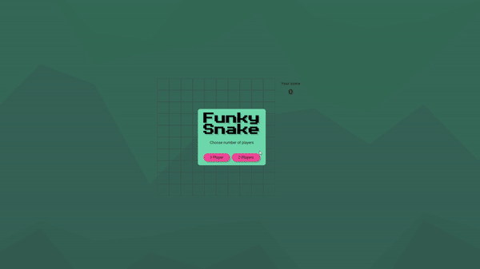

# Funky Snake [School Project]

Famous classic game. Up to two players.\
Snakes are controlled by keys and because of that, not mobile-friendly.

- It's built in vanilla JavaScript, HTML, and CSS.
- No JS canvas. Board consists of divs.
- 1st player controls with arrow keys
- 2nd player controls with **W** (up), **S** (down), **A** (left), **D** (right)

Check [Production Version](https://boisterous-dolphin-30f178.netlify.app/)